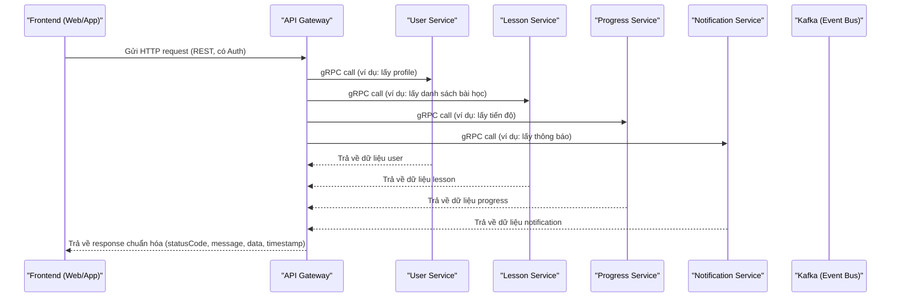
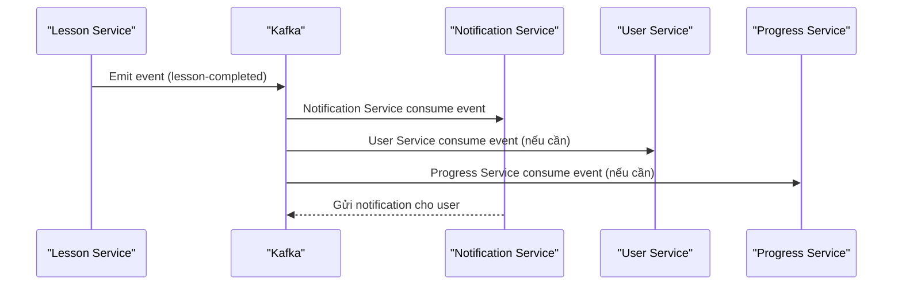

# 🚀 Puchi Backend - Modern Microservices Architecture

> **Backend cho dự án [Puchi](https://github.com/hoan02/puchi) - nền tảng học tiếng Việt hiện đại tại [puchi.io.vn](https://puchi.io.vn).**

## 📋 Tổng quan kiến trúc

- **API Gateway**: Entry point duy nhất cho client (REST), xác thực, routing, tích hợp gRPC client tới các service.
- **Các Microservice**: Giao tiếp nội bộ qua gRPC (sử dụng proto), chỉ expose gRPC endpoint.
- **Kafka**: Dùng cho event bất đồng bộ (notification, logging, background jobs...).
- **Database**: Mỗi service một database riêng biệt (PostgreSQL).
- **Chuẩn hóa response**: Tất cả API trả về `{ statusCode, message, data, timestamp }`.
- **Kubernetes/Docker**: Sẵn sàng cho production, tối ưu healthcheck, resource, scaling.

### Sơ đồ kiến trúc

```
Client Apps → REST → API Gateway → gRPC → Microservices
                                 ↘ Kafka (event async)
```

## 🔄 Luồng đi từ Frontend & Mối quan hệ giữa các service

### 1. Luồng request/response từ FE đến BE



### 2. Luồng event bất đồng bộ (Kafka)



### 3. Mối quan hệ giữa các service

- **API Gateway**: Entry point duy nhất cho FE, giao tiếp với các service qua gRPC (ClientGrpc), không xử lý business logic, chỉ xác thực, routing, chuẩn hóa response.
- **Các Microservice (User, Lesson, Progress, ...):** Chỉ expose gRPC endpoint, giao tiếp với nhau qua gRPC (sync) hoặc Kafka (async event), mỗi service quản lý database riêng, không truy cập chéo DB.
- **Kafka**: Event bus trung gian cho các event bất đồng bộ. Notification Service, Progress Service, User Service, ... có thể subscribe các event cần thiết.
- **Notification Service**: Chủ động lắng nghe các event từ Kafka (ví dụ: lesson-completed, user-registered) để gửi thông báo cho user.

---

## 🗄️ Danh sách service

| Service              | Port gRPC | Port HTTP | Vai trò/Chức năng           | Database   |
| -------------------- | --------- | --------- | --------------------------- | ---------- |
| API Gateway          | -         | 8000      | Cổng vào duy nhất, REST API | -          |
| User Service         | 50051     | -         | Quản lý user                | PostgreSQL |
| Lesson Service       | 50052     | -         | Quản lý bài học             | PostgreSQL |
| Progress Service     | 50053     | -         | Quản lý tiến trình          | PostgreSQL |
| Notification Service | 50054     | -         | Thông báo                   | PostgreSQL |
| Media Service        | 50055     | -         | Quản lý media               | MongoDB    |
| Quiz Service         | 50056     | -         | Quản lý quiz                | MongoDB    |
| Vocabulary Service   | 50057     | -         | Quản lý từ vựng             | PostgreSQL |
| Analytics Service    | 50058     | -         | Phân tích dữ liệu           | MongoDB    |

> **Lưu ý:**
>
> - Chỉ API Gateway expose port HTTP (8000) ra ngoài cho FE/client truy cập.
> - Các service khác chỉ expose port gRPC nội bộ để gateway gọi vào.
> - Polyglot persistence: PostgreSQL 17 cho các service core, MongoDB 8 cho analytics, media, quiz.

## 🚀 Khởi động hệ thống

### 1. Cài đặt dependencies

```bash
npm install
```

### 2. Cấu hình biến môi trường

- Mỗi service có file `env.example` riêng trong thư mục của mình. Copy thành `.env` và chỉnh sửa thông tin kết nối DB, Kafka, gRPC endpoint cho từng service.

### 3. Khởi động Docker (Bitnami Kafka KRaft mode, PostgreSQL 17, MongoDB 8, Kafka UI, MongoDB Express...)

```bash
docker-compose up -d
```

> **Lưu ý:**
>
> - Dự án đã chuyển sang sử dụng **Bitnami Kafka KRaft mode** (không còn Zookeeper).
> - Chỉ cần expose port cho api-gateway (8000:8000). Các service backend khác không cần port ra ngoài.
> - FE nên chạy ở port 3000, BE (gateway) ở 8000.

### 4. Migrate database cho từng service

Sau khi các container đã chạy, bạn cần migrate database cho từng service:

```bash
docker-compose exec user-service npx prisma migrate deploy --schema=apps/user-service/prisma/schema.prisma
docker-compose exec user-service npx prisma generate --schema=apps/user-service/prisma/schema.prisma
# Lặp lại cho các service khác (lesson-service, progress-service, ...)
```

### 5. Kiểm tra hệ thống

- Truy cập gateway: http://localhost:8000/api/health
- Swagger docs: http://localhost:8000/api-docs
- Kafka UI: http://localhost:8081
- MongoDB Express: http://localhost:8082

## 🧪 Testing

- **Health check:**
  ```
  curl http://localhost:8000/api/health
  ```
- **Test REST endpoint (qua API Gateway):**
  ```
  curl http://localhost:8000/api/lessons/list
  curl http://localhost:8000/api/users/profile
  ```
- **Test gRPC:**  
  Sử dụng các file proto trong thư mục `/proto` để test với Postman hoặc grpcurl.

## 🏗️ Cấu trúc project

```
puchi-be/
├── apps/                    # Microservices (api-gateway, user-service, ...)
├── libs/                    # Shared libraries (auth, utils, database, ...)
├── proto/                   # gRPC proto definitions
├── scripts/                 # Script build, deploy, test
├── docker-compose.yaml      # Docker infra (Kafka, PostgreSQL, MongoDB, ...)
└── README.md
```

## ⚡ Công nghệ & Best Practice

- **NestJS**: Framework chính cho cả API Gateway và các service.
- **gRPC**: Giao tiếp nội bộ giữa các service (proto chuẩn hóa).
- **Kafka (Bitnami KRaft mode)**: Event bất đồng bộ (notification, logging, ...).
- **Prisma**: ORM cho cả PostgreSQL và MongoDB, mỗi service một schema riêng.
- **Swagger**: Tự động sinh docs cho REST API tại API Gateway.
- **Validation, Exception Filter, Response Interceptor**: Chuẩn hóa response, validate input, xử lý lỗi tập trung.
- **Kubernetes-ready**: Healthcheck, resource limit, configmap, HPA, network policy.

## 🐳 Docker & Triển khai

- **Build image từng service:**
  ```
  docker build -t puchi-api-gateway ./apps/api-gateway
  docker build -t puchi-user-service ./apps/user-service
  # ...
  ```
- **Push image:**
  ```
  ./scripts/build-push-all.sh
  ```
- **Khởi động toàn bộ infra:**
  ```
  docker-compose up -d
  ```

## 🔒 Security

- **Authentication**: Clerk tích hợp tại API Gateway.
- **Authorization**: Role-based access control tại API Gateway.
- **Data Protection**: Validation, encryption, logging.

## 📚 Tài liệu

- Các file tài liệu chi tiết đã được tích hợp vào README.md này.
- File proto cho gRPC: `/proto/*.proto`
- Ví dụ cấu hình env: `apps/*/env.example`

## 🤝 Đóng góp

- Fork, tạo branch, PR như bình thường.
- Mọi ý kiến/đóng góp về kiến trúc, code, CI/CD, k8s đều hoan nghênh!
