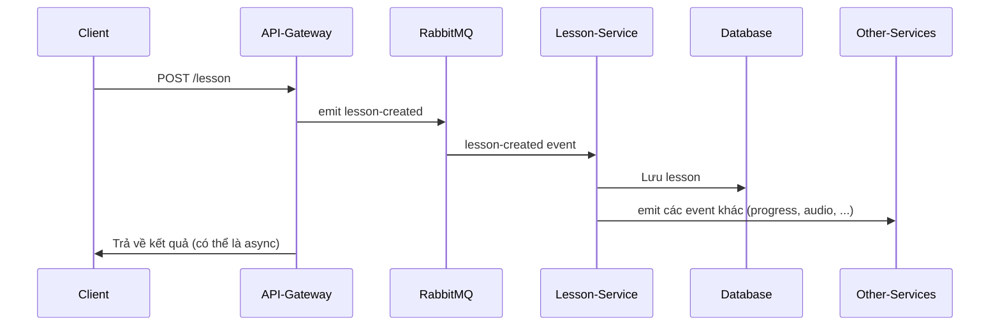

# PuchiBe Backend

PuchiBe là hệ thống backend sử dụng kiến trúc microservices, được xây dựng với NestJS, Prisma, RabbitMQ và quản lý bằng Nx Monorepo.

## 🚀 Công nghệ sử dụng

- **Node.js** + **TypeScript**
- **NestJS** (v11)
- **Prisma ORM**
- **RabbitMQ** (message broker)
- **Nx Monorepo**
- **Jest** (unit test)
- **ESLint, Prettier** (code style)
- **Docker Compose** (chạy RabbitMQ)

## 🏗️ Kiến trúc tổng quan

- **API Gateway**: Entry point cho client, nhận request và emit event qua RabbitMQ.
- **Lesson Service**: Xử lý logic bài học, lưu vào database, phát tán event sang các service khác.
- **Các service khác**: (progress, audio, notification, vocab) nhận event để xử lý nghiệp vụ riêng.
- **Shared Library**: Chứa DTO, interface, constants, utils dùng chung.

## 📦 Cấu trúc thư mục

```
apps/
  api-gateway/         # API Gateway service
  lesson-service/      # Lesson service
  ...-e2e/             # E2E test
libs/
  database/            # PrismaService, DatabaseModule
  shared/              # DTO, interface, utils
prisma/schema.prisma   # Định nghĩa database
```

## 🔄 Sơ đồ luồng hoạt động



## ⚙️ Hướng dẫn chạy dự án

1. Cài đặt dependencies:
   ```sh
   npm install
   ```
2. Chạy RabbitMQ bằng Docker:
   ```sh
   docker-compose up -d
   ```
3. Thiết lập database (PostgreSQL) và cập nhật biến môi trường `DATABASE_URL`.
4. Chạy migrate Prisma:
   ```sh
   npx prisma migrate dev
   ```
5. Khởi động các service:
   ```sh
   npx nx serve api-gateway
   npx nx serve lesson-service
   ```

## 📚 Một số lệnh hữu ích

- Build: `npx nx build <project>`
- Test: `npx nx test <project>`
- Xem project graph: `npx nx graph`

## 📞 Liên hệ & đóng góp

- Nếu có thắc mắc hoặc muốn đóng góp, hãy tạo issue hoặc pull request trên Github!
