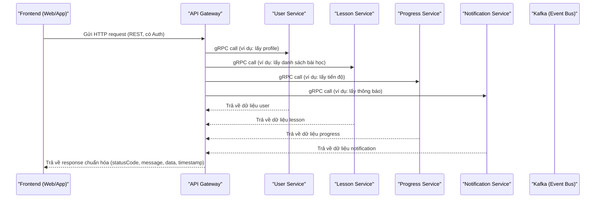
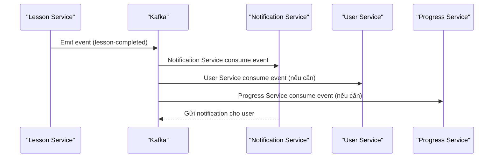
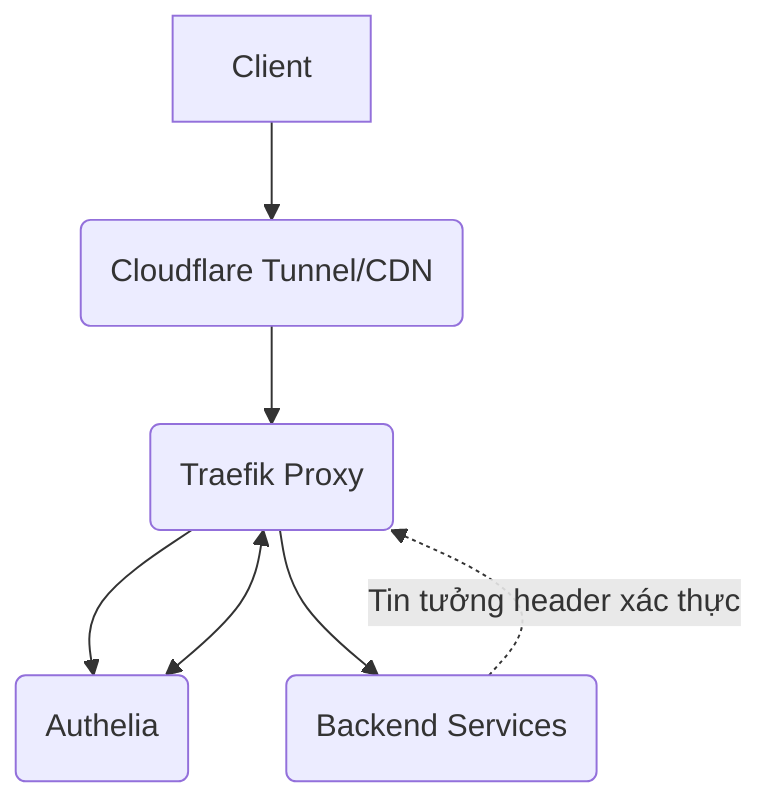

# 🚀 Puchi Backend - Modern Microservices Architecture

> **Backend cho dự án [Puchi](https://github.com/hoan02/puchi) - nền tảng học tiếng Việt hiện đại tại [puchi.io.vn](https://puchi.io.vn).**

## 📋 Tổng quan kiến trúc

- **API Gateway**: Entry point duy nhất cho client (REST), xác thực, routing, tích hợp gRPC client tới các service.
- **Các Microservice**: Giao tiếp nội bộ qua gRPC (sử dụng proto), chỉ expose gRPC endpoint.
- **Kafka**: Dùng cho event bất đồng bộ (notification, logging, background jobs...).
- **Polyglot Persistence**: PostgreSQL 17 cho các service core, MongoDB 8 cho analytics, media, quiz.
- **Chuẩn hóa response**: Tất cả API trả về `{ statusCode, message, data, timestamp }`.
- **Kubernetes/Docker**: Sẵn sàng cho production, tối ưu healthcheck, resource, scaling.

### Sơ đồ kiến trúc

```
Client Apps → REST → API Gateway → gRPC → Microservices
                                 ↘ Kafka (event async)

Databases:
├── PostgreSQL 17 (Core Services)
│   ├── User Service
│   ├── Lesson Service
│   ├── Progress Service
│   ├── Notification Service
│   └── Vocabulary Service
└── MongoDB 8 (Analytics Services)
    ├── Analytics Service
    ├── Media Service
    └── Quiz Service
```

## 🔄 Luồng đi từ Frontend & Mối quan hệ giữa các service

### 1. Luồng request/response từ FE đến BE



### 2. Luồng event bất đồng bộ (Kafka)



### 3. Mối quan hệ giữa các service

- **API Gateway**: Entry point duy nhất cho FE, giao tiếp với các service qua gRPC (ClientGrpc), không xử lý business logic, chỉ xác thực, routing, chuẩn hóa response.
- **Các Microservice (User, Lesson, Progress, ...):** Chỉ expose gRPC endpoint, giao tiếp với nhau qua gRPC (sync) hoặc Kafka (async event), mỗi service quản lý database riêng, không truy cập chéo DB.
- **Kafka**: Event bus trung gian cho các event bất đồng bộ. Notification Service, Progress Service, User Service, ... có thể subscribe các event cần thiết.
- **Notification Service**: Chủ động lắng nghe các event từ Kafka (ví dụ: lesson-completed, user-registered) để gửi thông báo cho user.

---

## 🗄️ Danh sách service

| Service              | Port gRPC | Port HTTP | Vai trò/Chức năng           | Database      |
| -------------------- | --------- | --------- | --------------------------- | ------------- |
| API Gateway          | -         | 8000      | Cổng vào duy nhất, REST API | -             |
| User Service         | 50051     | -         | Quản lý user                | PostgreSQL 17 |
| Lesson Service       | 50052     | -         | Quản lý bài học             | PostgreSQL 17 |
| Progress Service     | 50053     | -         | Quản lý tiến trình          | PostgreSQL 17 |
| Notification Service | 50054     | -         | Thông báo                   | PostgreSQL 17 |
| Media Service        | 50055     | -         | Quản lý media               | MongoDB 8     |
| Quiz Service         | 50056     | -         | Quản lý quiz                | MongoDB 8     |
| Vocabulary Service   | 50057     | -         | Quản lý từ vựng             | PostgreSQL 17 |
| Analytics Service    | 50058     | -         | Phân tích dữ liệu           | MongoDB 8     |

> **Lưu ý:**
>
> - Chỉ API Gateway expose port HTTP (8000) ra ngoài cho FE/client truy cập.
> - Các service khác chỉ expose port gRPC nội bộ để gateway gọi vào.
> - **Polyglot Persistence**: PostgreSQL 17 cho các service core (ACID transactions), MongoDB 8 cho analytics, media, quiz (flexible schema).

## 🚀 Khởi động hệ thống

### 1. Cài đặt dependencies

```bash
npm install
```

### 2. Cấu hình biến môi trường

```bash
# Copy file env.example thành .env
cp env.example .env

# Chỉnh sửa file .env với các giá trị thực tế
# - POSTGRES_PASSWORD: Mật khẩu cho PostgreSQL
# - MONGO_ROOT_PASSWORD: Mật khẩu cho MongoDB
# - TUNNEL_TOKEN: Token cho Cloudflare Tunnel (nếu sử dụng)
```

### 3. Khởi động Docker (Bitnami Kafka KRaft mode, PostgreSQL 17, MongoDB 8)

```bash
# Khởi động toàn bộ hệ thống
docker-compose up -d

# Hoặc khởi động từng phần
docker-compose up -d kafka postgresql mongodb
docker-compose up -d user-service lesson-service progress-service
docker-compose up -d analytics-service media-service quiz-service
```

> **Lưu ý:**
>
> - Dự án đã chuyển sang sử dụng **Bitnami Kafka KRaft mode** (không còn Zookeeper).
> - **PostgreSQL 17**: Cho các service core cần ACID transactions.
> - **MongoDB 8**: Cho các service analytics, media, quiz cần flexible schema.
> - Chỉ cần expose port cho api-gateway (8000:8000). Các service backend khác không cần port ra ngoài.
> - FE nên chạy ở port 3000, BE (gateway) ở 8000.

### 4. Kiểm tra hệ thống

- **API Gateway**: http://localhost:8000/api/health
- **Swagger docs**: http://localhost:8000/api-docs
- **Kafka UI**: http://localhost:8081
- **MongoDB Express**: http://localhost:8082

## 🌐 Cloudflare Tunnel (Tùy chọn - cho development/public access)

### 1. Cài đặt Cloudflare Tunnel

```bash
# Windows (PowerShell)
winget install Cloudflare.cloudflared

# Hoặc tải từ: https://github.com/cloudflare/cloudflared/releases
```

### 2. Đăng nhập và tạo tunnel

```bash
# Đăng nhập Cloudflare
cloudflared login

# Tạo tunnel mới
cloudflared tunnel create puchi-dev
```

### 3. Cấu hình tunnel

1. **Chỉnh sửa file `cloudflared-config.yaml`:**
   - Thay `your-domain.com` bằng domain thực của bạn
   - Điều chỉnh các hostname theo ý muốn

2. **Khởi động tunnel:**

   ```bash
   # Cách 1: Sử dụng PowerShell script
   .\start-tunnel.ps1

   # Cách 2: Chạy trực tiếp
   cloudflared tunnel --config cloudflared-config.yaml run puchi-dev

   # Cách 3: Sử dụng Docker
   docker-compose -f docker-compose.tunnel.yaml up -d
   ```

### 4. Truy cập qua Cloudflare Tunnel

Sau khi tunnel hoạt động, bạn có thể truy cập:

- **API Gateway**: `https://api.puchi.io.vn`
- **Kafka UI**: `https://kafka.puchi.io.vn`

> **Lưu ý:** Cloudflare Tunnel cung cấp SSL tự động và bảo mật, phù hợp cho development và demo.

## 🧪 Testing

- **Health check:**
  ```
  curl http://localhost:8000/api/health
  ```
- **Test REST endpoint (qua API Gateway):**
  ```
  curl http://localhost:8000/api/lessons/list
  curl http://localhost:8000/api/users/profile
  ```
- **Test gRPC:**  
  Sử dụng các file proto trong thư mục `/proto` để test với Postman hoặc grpcurl.

## 🏗️ Cấu trúc project

```
puchi-be/
├── apps/                    # Microservices (api-gateway, user-service, ...)
│   ├── api-gateway/         # REST API Gateway
│   ├── user-service/        # PostgreSQL 17
│   ├── lesson-service/      # PostgreSQL 17
│   ├── progress-service/    # PostgreSQL 17
│   ├── notification-service/# PostgreSQL 17
│   ├── vocabulary-service/  # PostgreSQL 17
│   ├── analytics-service/   # MongoDB 8
│   ├── media-service/       # MongoDB 8
│   └── quiz-service/        # MongoDB 8
├── libs/                    # Shared libraries (auth, utils, database, ...)
├── proto/                   # gRPC proto definitions
├── scripts/                 # Script build, deploy, test
├── docker-compose.yaml      # Docker infra (Kafka, PostgreSQL 17, MongoDB 8, ...)
└── README.md
```

## ⚡ Công nghệ & Best Practice

- **NestJS**: Framework chính cho cả API Gateway và các service.
- **gRPC**: Giao tiếp nội bộ giữa các service (proto chuẩn hóa).
- **Kafka (Bitnami KRaft mode)**: Event bất đồng bộ (notification, logging, ...).
- **Prisma**: ORM cho cả PostgreSQL 17 và MongoDB 8, mỗi service một schema riêng.
- **Polyglot Persistence**: PostgreSQL 17 cho ACID transactions, MongoDB 8 cho flexible schema.
- **Swagger**: Tự động sinh docs cho REST API tại API Gateway.
- **Validation, Exception Filter, Response Interceptor**: Chuẩn hóa response, validate input, xử lý lỗi tập trung.
- **Kubernetes-ready**: Healthcheck, resource limit, configmap, HPA, network policy.

## 🐳 Docker & Triển khai

- **Build image từng service:**
  ```
  docker-compose build user-service lesson-service
  docker-compose build analytics-service media-service quiz-service
  ```
- **Khởi động toàn bộ infra:**
  ```
  docker-compose up -d
  ```

## 🔒 Security

- **Authentication**: Sử dụng combo Cloudflare Tunnel + Traefik (reverse proxy) + Authelia (SSO, xác thực tập trung).
  - Cloudflare Tunnel/CDN bảo vệ ngoài cùng, chỉ expose Traefik ra internet.
  - Traefik làm reverse proxy, forward xác thực tới Authelia qua middleware `forwardAuth`.
  - Authelia xác thực user, trả về các header (`Remote-User`, `Remote-Email`, `Remote-Groups`, `Remote-Name`).
  - Backend chỉ tin tưởng các header này khi request đi qua proxy.
  - Các route public vẫn hoạt động bình thường (dùng @Public()).
  - Tham khảo tài liệu chính thức: https://www.authelia.com/integration/proxies/traefik/
- **Authorization**: Role-based access control tại API Gateway (dựa vào trường `groups` do Authelia trả về).
- **Data Protection**: Validation, encryption, logging.

### Sơ đồ xác thực



### Ví dụ cấu hình middleware cho Traefik:

```yaml
http:
  middlewares:
    authelia:
      forwardAuth:
        address: 'http://authelia:9091/api/authz/forward-auth'
        trustForwardHeader: true
        authResponseHeaders:
          - 'Remote-User'
          - 'Remote-Groups'
          - 'Remote-Email'
          - 'Remote-Name'
```

### Backend (NestJS) sẽ:

- Dùng guard AutheliaAuthGuard kiểm tra các header xác thực.
- Dùng decorator CurrentUser để lấy thông tin user từ request.
- Không tự verify lại JWT, chỉ tin tưởng header do proxy forward.

### Tham khảo file mẫu:

- `k8s/cloudflared-tunnel.yaml`
- `k8s/traefik.yaml`
- `k8s/authelia.yaml`

## 📚 Tài liệu

- Các file tài liệu chi tiết đã được tích hợp vào README.md này.
- File proto cho gRPC: `/proto/*.proto`
- Ví dụ cấu hình env: `apps/*/env.example`

## 🤝 Đóng góp

- Fork, tạo branch, PR như bình thường.
- Mọi ý kiến/đóng góp về kiến trúc, code, CI/CD, k8s đều hoan nghênh!
