# 🚀 Puchi Backend - Modern Microservices Architecture

> **Backend cho dự án [Puchi](https://github.com/hoan02/puchi) - nền tảng học tiếng Việt hiện đại tại [puchi.io.vn](https://puchi.io.vn).**

## 📋 Tổng quan kiến trúc

- **API Gateway**: Entry point duy nhất cho client (REST), xác thực, routing, tích hợp gRPC client tới các service.
- **Các Microservice**: Giao tiếp nội bộ qua gRPC (sử dụng proto), chỉ expose gRPC endpoint.
- **Kafka**: Dùng cho event bất đồng bộ (notification, logging, background jobs...).
- **Database**: Mỗi service một database riêng biệt (PostgreSQL).
- **Chuẩn hóa response**: Tất cả API trả về `{ statusCode, message, data, timestamp }`.
- **Kubernetes/Docker**: Sẵn sàng cho production, tối ưu healthcheck, resource, scaling.

### Sơ đồ kiến trúc

```
Client Apps → REST → API Gateway → gRPC → Microservices
                                 ↘ Kafka (event async)
```

## 🔄 Luồng đi từ Frontend & Mối quan hệ giữa các service

### 1. Luồng request/response từ FE đến BE

```mermaid
sequenceDiagram
    participant FE as "Frontend (Web/App)"
    participant GW as "API Gateway"
    participant US as "User Service"
    participant LS as "Lesson Service"
    participant PS as "Progress Service"
    participant NS as "Notification Service"
    participant KAFKA as "Kafka (Event Bus)"

    FE->>GW: Gửi HTTP request (REST, có Auth)
    GW->>US: gRPC call (ví dụ: lấy profile)
    GW->>LS: gRPC call (ví dụ: lấy danh sách bài học)
    GW->>PS: gRPC call (ví dụ: lấy tiến độ)
    GW->>NS: gRPC call (ví dụ: lấy thông báo)
    US-->>GW: Trả về dữ liệu user
    LS-->>GW: Trả về dữ liệu lesson
    PS-->>GW: Trả về dữ liệu progress
    NS-->>GW: Trả về dữ liệu notification
    GW-->>FE: Trả về response chuẩn hóa (statusCode, message, data, timestamp)
```



### 2. Luồng event bất đồng bộ (Kafka)

```mermaid
sequenceDiagram
    participant LS as "Lesson Service"
    participant KAFKA as "Kafka"
    participant NS as "Notification Service"
    participant US as "User Service"
    participant PS as "Progress Service"

    LS->>KAFKA: Emit event (lesson-completed)
    KAFKA->>NS: Notification Service consume event
    KAFKA->>US: User Service consume event (nếu cần)
    KAFKA->>PS: Progress Service consume event (nếu cần)
    NS-->>KAFKA: Gửi notification cho user
```



### 3. Mối quan hệ giữa các service

- **API Gateway**: Entry point duy nhất cho FE, giao tiếp với các service qua gRPC (ClientGrpc), không xử lý business logic, chỉ xác thực, routing, chuẩn hóa response.
- **Các Microservice (User, Lesson, Progress, ...):** Chỉ expose gRPC endpoint, giao tiếp với nhau qua gRPC (sync) hoặc Kafka (async event), mỗi service quản lý database riêng, không truy cập chéo DB.
- **Kafka**: Event bus trung gian cho các event bất đồng bộ. Notification Service, Progress Service, User Service, ... có thể subscribe các event cần thiết.
- **Notification Service**: Chủ động lắng nghe các event từ Kafka (ví dụ: lesson-completed, user-registered) để gửi thông báo cho user.

---

## 🔧 Danh sách service

| Service              | Port gRPC | Port HTTP | Vai trò/Chức năng           | Database        |
| -------------------- | --------- | --------- | --------------------------- | --------------- |
| API Gateway          | -         | 9000      | Cổng vào duy nhất, REST API | -               |
| User Service         | 50051     | -         | Quản lý user                | user-db         |
| Lesson Service       | 50052     | -         | Quản lý bài học             | lesson-db       |
| Progress Service     | 50053     | -         | Quản lý tiến trình          | progress-db     |
| Notification Service | 50054     | -         | Thông báo                   | notification-db |
| Media Service        | 50055     | -         | Quản lý media               | media-db        |
| Quiz Service         | 50056     | -         | Quản lý quiz                | quiz-db         |
| Vocabulary Service   | 50057     | -         | Quản lý từ vựng             | vocabulary-db   |
| Analytics Service    | 50058     | -         | Phân tích dữ liệu           | analytics-db    |

> **Lưu ý:**
>
> - Chỉ API Gateway expose port HTTP (9000) ra ngoài cho FE/client truy cập.
> - Các service khác chỉ expose port gRPC nội bộ để gateway gọi vào.

## 🚀 Khởi động hệ thống

### 1. Cài đặt dependencies

```bash
npm install
```

### 2. Cấu hình biến môi trường

Tạo file `.env.local` hoặc copy từ `env.local.example.txt` và chỉnh sửa thông tin kết nối DB, Kafka, gRPC endpoint cho từng service.

### 3. Khởi động Docker (Kafka, Postgres, Kafka UI, các service backend...)

```bash
docker-compose -f docker-compose.yaml up -d
```

> **Lưu ý:**
>
> - Chỉ cần expose port cho api-gateway (9000:9000). Các service backend khác không cần port ra ngoài.
> - FE nên chạy ở port 3000, BE (gateway) ở 9000.

### 4. Migrate database cho từng service (ví dụ user-service)

Sau khi các container đã chạy, bạn cần migrate database cho từng service:

```bash
docker-compose -f docker-compose.yaml exec user-service npx prisma migrate deploy --schema=apps/user-service/prisma/schema.prisma
docker-compose -f docker-compose.yaml exec user-service npx prisma generate --schema=apps/user-service/prisma/schema.prisma
# Lặp lại cho các service khác (lesson-service, progress-service, ...)
```

### 5. Kiểm tra hệ thống

- Truy cập gateway: http://localhost:9000/api/health
- Swagger docs: http://localhost:9000/api-docs
- Kafka UI: http://localhost:8080

### 6. Deploy lên Coolify

- Tạo app stack mới, chọn file `docker-compose.yaml` ở project root.
- Coolify sẽ tự build và khởi động toàn bộ hệ thống.
- Sau khi deploy, SSH vào container từng service để migrate database như bước 4.

## 🧪 Testing

- **Health check:**
  ```
  curl http://localhost:9000/api/health
  ```
- **Test REST endpoint (qua API Gateway):**
  ```
  curl http://localhost:9000/api/lessons/list
  curl http://localhost:9000/api/users/profile
  ```
- **Test gRPC:**  
  Sử dụng các file proto trong thư mục `/proto` để test với Postman hoặc grpcurl.

## 🏗️ Cấu trúc project

```
puchi-be/
├── apps/                    # Microservices (api-gateway, user-service, ...)
├── libs/                    # Shared libraries (auth, utils, database, ...)
├── proto/                   # gRPC proto definitions
├── scripts/                 # Script build, deploy, test
├── docker-compose.yaml      # Docker infra (Kafka, Postgres, ...)
└── README.md
```

## ⚡ Công nghệ & Best Practice

- **NestJS**: Framework chính cho cả API Gateway và các service.
- **gRPC**: Giao tiếp nội bộ giữa các service (proto chuẩn hóa).
- **Kafka**: Event bất đồng bộ (notification, logging, ...).
- **Prisma**: ORM cho PostgreSQL, mỗi service một schema riêng.
- **Swagger**: Tự động sinh docs cho REST API tại API Gateway.
- **Validation, Exception Filter, Response Interceptor**: Chuẩn hóa response, validate input, xử lý lỗi tập trung.
- **Kubernetes-ready**: Healthcheck, resource limit, configmap, HPA, network policy.

## 🐳 Docker & Triển khai

- **Build image từng service:**
  ```
  docker build -t puchi-api-gateway ./apps/api-gateway
  docker build -t puchi-user-service ./apps/user-service
  # ...
  ```
- **Push image:**
  ```
  ./scripts/build-push-all.sh
  ```
- **Khởi động toàn bộ infra:**
  ```
  docker-compose up -d
  ```

## 🔐 Security

- **Authentication**: Clerk tích hợp tại API Gateway.
- **Authorization**: Role-based access control tại API Gateway.
- **Data Protection**: Validation, encryption, logging.

## 📚 Tài liệu

- Các file tài liệu chi tiết đã được tích hợp vào README.md này.
- File proto cho gRPC: `/proto/*.proto`
- Ví dụ cấu hình env: `env.local.example.txt`

## 🤝 Đóng góp

- Fork, tạo branch, PR như bình thường.
- Mọi ý kiến/đóng góp về kiến trúc, code, CI/CD, k8s đều hoan nghênh!
