# 🚀 Puchi Backend - Modern Microservices Architecture

> **Backend cho dự án [Puchi](https://github.com/hoan02/puchi) - nền tảng học tiếng Việt hiện đại tại [puchi.io.vn](https://puchi.io.vn).**

## 📋 Tổng quan kiến trúc

- **API Gateway**: Entry point duy nhất cho client (REST), xác thực, routing, tích hợp gRPC client tới các service.
- **Các Microservice**: Giao tiếp nội bộ qua gRPC (sử dụng proto), chỉ expose gRPC endpoint.
- **Kafka**: Dùng cho event bất đồng bộ (notification, logging, background jobs...).
- **Polyglot Persistence**: PostgreSQL 17 cho các service core, MongoDB 8 cho analytics, media, quiz.
- **Chuẩn hóa response**: Tất cả API trả về `{ statusCode, message, data, timestamp }`.
- **Kubernetes/Docker**: Sẵn sàng cho production, tối ưu healthcheck, resource, scaling.

### Sơ đồ kiến trúc

```
Client Apps → REST → API Gateway → gRPC → Microservices
                                 ↘ Kafka (event async)

Databases:
├── PostgreSQL 17 (Core Services)
│   ├── User Service
│   ├── Lesson Service
│   ├── Progress Service
│   ├── Notification Service
│   └── Vocabulary Service
└── MongoDB 8 (Analytics Services)
    ├── Analytics Service
    ├── Media Service
    └── Quiz Service
```

## 🔄 Luồng đi từ Frontend & Mối quan hệ giữa các service

### 1. Luồng request/response từ FE đến BE

```mermaid
sequenceDiagram
    participant FE as "Frontend (Web/App)"
    participant GW as "API Gateway"
    participant US as "User Service"
    participant LS as "Lesson Service"
    participant PS as "Progress Service"
    participant NS as "Notification Service"
    participant KAFKA as "Kafka (Event Bus)"

    FE->>GW: Gửi HTTP request (REST, có Auth)
    GW->>US: gRPC call (ví dụ: lấy profile)
    GW->>LS: gRPC call (ví dụ: lấy danh sách bài học)
    GW->>PS: gRPC call (ví dụ: lấy tiến độ)
    GW->>NS: gRPC call (ví dụ: lấy thông báo)
    US-->>GW: Trả về dữ liệu user
    LS-->>GW: Trả về dữ liệu lesson
    PS-->>GW: Trả về dữ liệu progress
    NS-->>GW: Trả về dữ liệu notification
    GW-->>FE: Trả về response chuẩn hóa (statusCode, message, data, timestamp)
```



### 2. Luồng event bất đồng bộ (Kafka)

```mermaid
sequenceDiagram
    participant LS as "Lesson Service"
    participant KAFKA as "Kafka"
    participant NS as "Notification Service"
    participant US as "User Service"
    participant PS as "Progress Service"

    LS->>KAFKA: Emit event (lesson-completed)
    KAFKA->>NS: Notification Service consume event
    KAFKA->>US: User Service consume event (nếu cần)
    KAFKA->>PS: Progress Service consume event (nếu cần)
    NS-->>KAFKA: Gửi notification cho user
```



### 3. Mối quan hệ giữa các service

- **API Gateway**: Entry point duy nhất cho FE, giao tiếp với các service qua gRPC (ClientGrpc), không xử lý business logic, chỉ xác thực, routing, chuẩn hóa response.
- **Các Microservice (User, Lesson, Progress, ...):** Chỉ expose gRPC endpoint, giao tiếp với nhau qua gRPC (sync) hoặc Kafka (async event), mỗi service quản lý database riêng, không truy cập chéo DB.
- **Kafka**: Event bus trung gian cho các event bất đồng bộ. Notification Service, Progress Service, User Service, ... có thể subscribe các event cần thiết.
- **Notification Service**: Chủ động lắng nghe các event từ Kafka (ví dụ: lesson-completed, user-registered) để gửi thông báo cho user.

---

## 🗄️ Danh sách service

| Service              | Port gRPC | Port HTTP | Vai trò/Chức năng           | Database      |
| -------------------- | --------- | --------- | --------------------------- | ------------- |
| API Gateway          | -         | 8000      | Cổng vào duy nhất, REST API | -             |
| User Service         | 50051     | -         | Quản lý user                | PostgreSQL 17 |
| Lesson Service       | 50052     | -         | Quản lý bài học             | PostgreSQL 17 |
| Progress Service     | 50053     | -         | Quản lý tiến trình          | PostgreSQL 17 |
| Notification Service | 50054     | -         | Thông báo                   | PostgreSQL 17 |
| Media Service        | 50055     | -         | Quản lý media               | MongoDB 8     |
| Quiz Service         | 50056     | -         | Quản lý quiz                | MongoDB 8     |
| Vocabulary Service   | 50057     | -         | Quản lý từ vựng             | PostgreSQL 17 |
| Analytics Service    | 50058     | -         | Phân tích dữ liệu           | MongoDB 8     |

> **Lưu ý:**
>
> - Chỉ API Gateway expose port HTTP (8000) ra ngoài cho FE/client truy cập.
> - Các service khác chỉ expose port gRPC nội bộ để gateway gọi vào.
> - **Polyglot Persistence**: PostgreSQL 17 cho các service core (ACID transactions), MongoDB 8 cho analytics, media, quiz (flexible schema).

## 🚀 Khởi động hệ thống

### 1. Cài đặt dependencies

```bash
npm install
```

### 2. Cấu hình biến môi trường

- Mỗi service có file `env.example` riêng trong thư mục của mình. Copy thành `.env` và chỉnh sửa thông tin kết nối DB, Kafka, gRPC endpoint cho từng service.

### 3. Khởi động Docker (Bitnami Kafka KRaft mode, PostgreSQL 17, MongoDB 8)

```bash
# Khởi động toàn bộ hệ thống
docker-compose up -d

# Hoặc khởi động từng phần
docker-compose up -d kafka postgresql mongodb
docker-compose up -d user-service lesson-service progress-service
docker-compose up -d analytics-service media-service quiz-service
```

> **Lưu ý:**
>
> - Dự án đã chuyển sang sử dụng **Bitnami Kafka KRaft mode** (không còn Zookeeper).
> - **PostgreSQL 17**: Cho các service core cần ACID transactions.
> - **MongoDB 8**: Cho các service analytics, media, quiz cần flexible schema.
> - Chỉ cần expose port cho api-gateway (8000:8000). Các service backend khác không cần port ra ngoài.
> - FE nên chạy ở port 3000, BE (gateway) ở 8000.

### 4. Kiểm tra hệ thống

- **API Gateway**: http://localhost:8000/api/health
- **Swagger docs**: http://localhost:8000/api-docs
- **Kafka UI**: http://localhost:8081
- **MongoDB Express**: http://localhost:8082

## 🧪 Testing

- **Health check:**
  ```
  curl http://localhost:8000/api/health
  ```
- **Test REST endpoint (qua API Gateway):**
  ```
  curl http://localhost:8000/api/lessons/list
  curl http://localhost:8000/api/users/profile
  ```
- **Test gRPC:**  
  Sử dụng các file proto trong thư mục `/proto` để test với Postman hoặc grpcurl.

## 🏗️ Cấu trúc project

```
puchi-be/
├── apps/                    # Microservices (api-gateway, user-service, ...)
│   ├── api-gateway/         # REST API Gateway
│   ├── user-service/        # PostgreSQL 17
│   ├── lesson-service/      # PostgreSQL 17
│   ├── progress-service/    # PostgreSQL 17
│   ├── notification-service/# PostgreSQL 17
│   ├── vocabulary-service/  # PostgreSQL 17
│   ├── analytics-service/   # MongoDB 8
│   ├── media-service/       # MongoDB 8
│   └── quiz-service/        # MongoDB 8
├── libs/                    # Shared libraries (auth, utils, database, ...)
├── proto/                   # gRPC proto definitions
├── scripts/                 # Script build, deploy, test
├── docker-compose.yaml      # Docker infra (Kafka, PostgreSQL 17, MongoDB 8, ...)
└── README.md
```

## ⚡ Công nghệ & Best Practice

- **NestJS**: Framework chính cho cả API Gateway và các service.
- **gRPC**: Giao tiếp nội bộ giữa các service (proto chuẩn hóa).
- **Kafka (Bitnami KRaft mode)**: Event bất đồng bộ (notification, logging, ...).
- **Prisma**: ORM cho cả PostgreSQL 17 và MongoDB 8, mỗi service một schema riêng.
- **Polyglot Persistence**: PostgreSQL 17 cho ACID transactions, MongoDB 8 cho flexible schema.
- **Swagger**: Tự động sinh docs cho REST API tại API Gateway.
- **Validation, Exception Filter, Response Interceptor**: Chuẩn hóa response, validate input, xử lý lỗi tập trung.
- **Kubernetes-ready**: Healthcheck, resource limit, configmap, HPA, network policy.

## 🐳 Docker & Triển khai

- **Build image từng service:**
  ```
  docker-compose build user-service lesson-service
  docker-compose build analytics-service media-service quiz-service
  ```
- **Khởi động toàn bộ infra:**
  ```
  docker-compose up -d
  ```

## 🔒 Security

- **Authentication**: Clerk tích hợp tại API Gateway.
- **Authorization**: Role-based access control tại API Gateway.
- **Data Protection**: Validation, encryption, logging.

## 📚 Tài liệu

- Các file tài liệu chi tiết đã được tích hợp vào README.md này.
- File proto cho gRPC: `/proto/*.proto`
- Ví dụ cấu hình env: `apps/*/env.example`

## 🤝 Đóng góp

- Fork, tạo branch, PR như bình thường.
- Mọi ý kiến/đóng góp về kiến trúc, code, CI/CD, k8s đều hoan nghênh!
